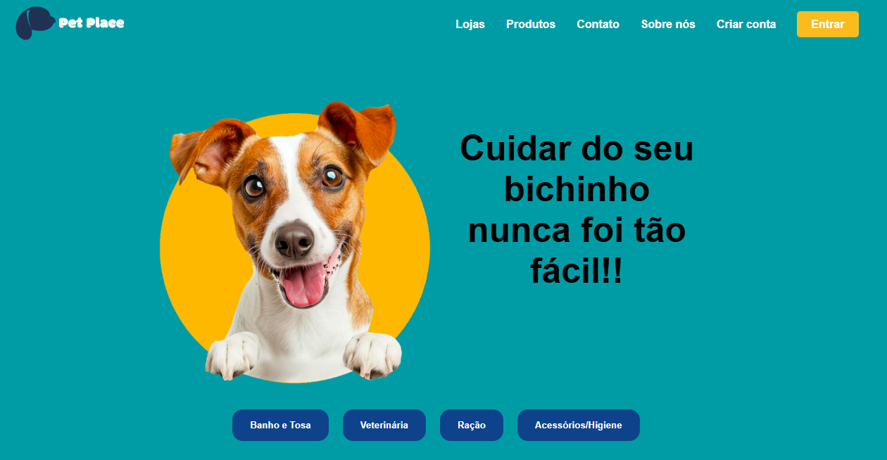

# PetPlace

> O projeto é um marketplace de produtos e serviços para pets. As empresas e os profissionais se cadastram, os clientes (pais de pets/tutores) podem navegar, comparar, escolher e comprar diversos pordutos e serviços em um só lugar!

## 🤝 Devs

Equipe 02 do curso Proz Educação:

<table>
  <tr>
    <td align="center">
      <a href="https://github.com/Chioe2178" title="GitHub">
         
        
          <b>Chioe2178</b>
        
      </a>
    </td>
    <td align="center">
      <a href="https://github.com/RhoniPinheiro" title="GitHub">
         
        
          <b>RhoniPinheiro</b>
        
      </a>
    </td>
    <td align="center">
      <a href="https://github.com/AnaBeatriz20024" title="GitHub">
         
        
          <b>AnaBeatriz20024</b>
        
      </a>
    </td>
        <td align="center">
      <a href="https://github.com/EwertonHecsley" title="GitHub">
         
        
          <b>EwertonHecsley</b>
        
      </a>
    </td>
            <td align="center">
      <a href="https://github.com/AnaBeatriz20024" title="GitHub">
         
        
          <b>CEGS9</b>
        
      </a>
    </td>
  </tr>
</table>
